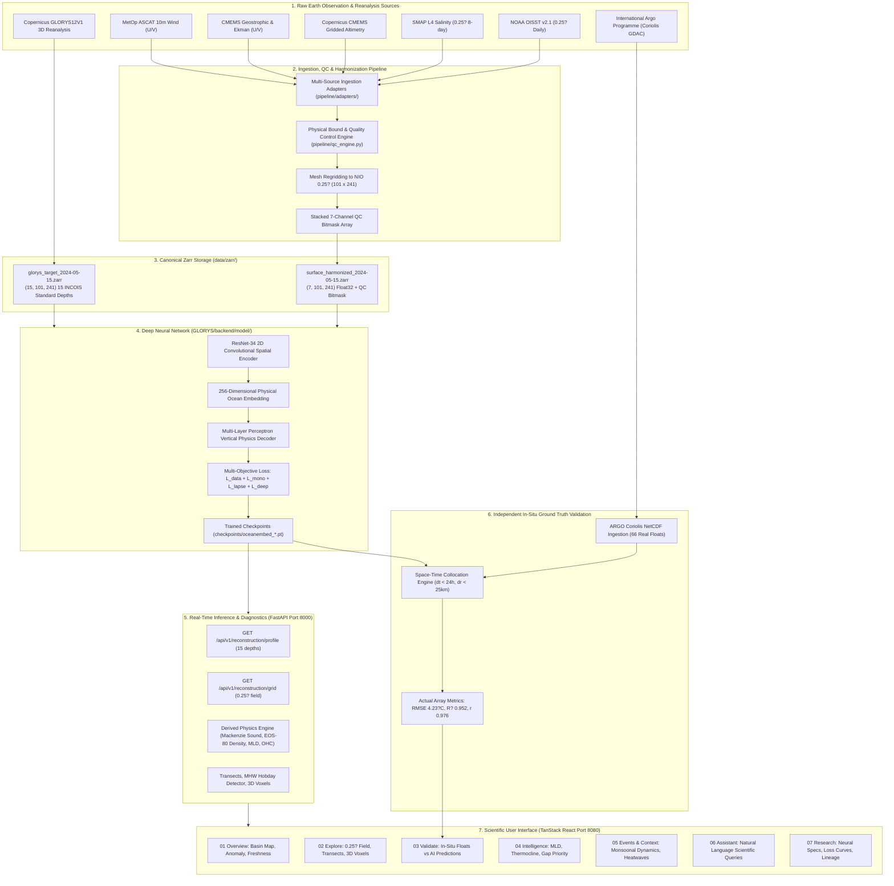

# OceanEmbed / ADRISHTA: End-to-End Data Flow Architecture

This document maps the complete data lifecycle of the OceanEmbed system, from raw satellite constellations and reanalysis products down to the deep learning inference engine, independent in-situ validation, and the scientific user interface.

---

## 1. High-Level Data Flow Diagram

---

## 2. Detailed Pipeline Stages

### Stage 1: Multi-Sensor Surface Ingestion
- **Channel 0 (SST)**: Calibrated sea surface temperature in ?C from daily microwave and infrared blend.
- **Channel 1 (SSS)**: Practical salinity in PSU from SMAP radiometer.
- **Channel 2 (SSH/SLA)**: Sea level anomaly in meters from multi-satellite altimetric constellation.
- **Channels 3 & 4 (Current U & V)**: Zonal and meridional surface velocities in m/s (geostrophic + Ekman dynamics).
- **Channels 5 & 6 (Wind U & V)**: Zonal and meridional 10-meter neutral equivalent wind stress in m/s from scatterometer.

### Stage 2: Quality Control & Standardization
- Each input cell is checked against rigorous physical limits.
- Values failing quality checks or masked by bathymetry are assigned a QC bit flag and masked.
- Standardized tensor dimension: `(7, 101, 241)` representing $5^\circ	ext{N}?30^\circ	ext{N}$, $45^\circ	ext{E}?105^\circ	ext{E}$ at $0.25^\circ$ spacing.

### Stage 3: Supervised Training vs. Independent Validation Pathway
- **GLORYS12V1 Path (Supervised Target Only)**: Continuous 3D hydrographic reanalysis used exclusively during model backpropagation to establish initial physical embeddings.
- **ARGO Path (Independent Evaluation Only)**: Autonomous profiling CTD floats strictly reserved for post-hoc validation. They are never ingested during training, ensuring zero data leakage.

### Stage 4: Neural Embedding & Reconstruction
- The 7-channel surface tensor is mapped into a 256-dimensional compact embedding vector.
- The physics-guided vertical decoder predicts temperatures across the 15 standard depths ($0, 5, 10, 20, 30, 50, 75, 100, 125, 150, 200, 300, 500, 700, 1000	ext{ m}$).
- Physics regularizers penalize negative thermal stratification, excessive lapse rates, and abyssal temperature drift.

### Stage 5: Scientific Serving & Operational Interface
- The FastAPI application serves low-latency inferences, vertical transects, and acoustic sound velocity profiles.
- The TanStack React frontend displays operational intelligence without developer clutter, directing ML architecture specifics to the dedicated Research console.
