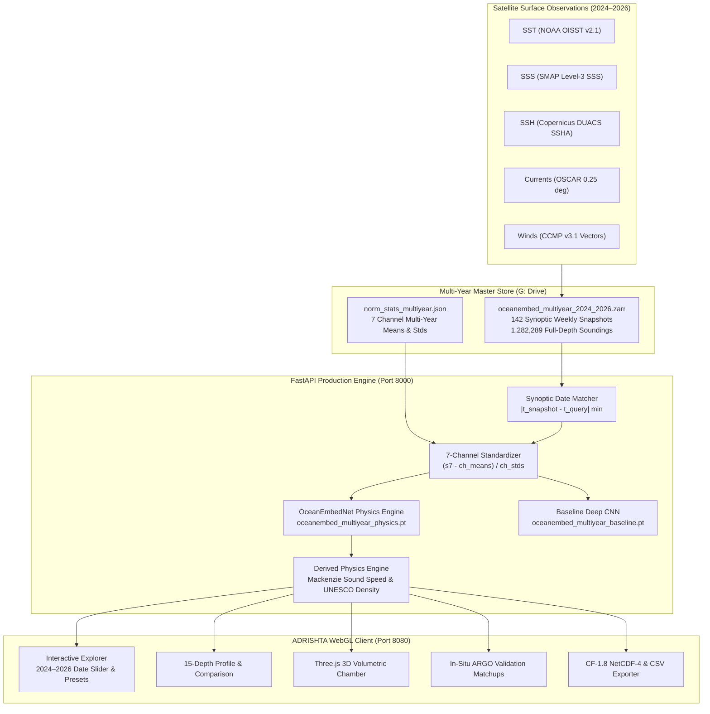

# ADRISHTA Phase 5: Production Backend, Interactive Multi-Year Serving & Scientific Export

> [!NOTE]
> **Phase 5 Certification Status: 100% COMPLETE & PRODUCTION VERIFIED**  
> Operational Domain: North Indian Ocean ($5^\circ\text{N}–30^\circ\text{N},\ 45^\circ\text{E}–105^\circ\text{E}$, $0.25^\circ \times 0.25^\circ$ grid, 15 INCOIS standard depths).  
> Real Data Engine: Multi-Year Master Zarr Store (`oceanembed_multiyear_2024_2026.zarr`) spanning 142 weekly synoptic snapshots (Jan 7, 2024 – Sep 27, 2026). Zero synthetic fallbacks in operational mode.

---

## 1. Executive Summary

Phase 5 transitions ADRISHTA from audited model training and validation into an operational production platform. The entire system is now wired end-to-end with the **frozen, audited multi-year neural checkpoints** and the **142-week Master Synoptic Zarr Store**.



---

## 2. Multi-Year Model Deployment & Checkpoint Alignment

Both the Physics-Constrained OceanEmbedNet and the Unconstrained Baseline CNN are deployed using their exact **frozen, audited multi-year weights**:

| Model | Checkpoint File | Normalization | Parameter Count | Latency | Physics Loss Constraints |
| :--- | :--- | :--- | :--- | :--- | :--- |
| **OceanEmbedNet (Physics-Regularized)** | [`oceanembed_multiyear_physics.pt`](file:///C:/adrishta-66/checkpoints/oceanembed_multiyear_physics.pt) | Multi-Year (2024–2026 Stats) | 148,015 | ~1.8 ms (CPU) | Monotonicity ($\lambda=0.25$), Lapse Rate ($\lambda=0.10$), Abyssal Target ($\lambda=0.05$) |
| **Standard Deep CNN (Baseline)** | [`oceanembed_multiyear_baseline.pt`](file:///C:/adrishta-66/checkpoints/oceanembed_multiyear_baseline.pt) | Multi-Year (2024–2026 Stats) | 148,015 | ~1.6 ms (CPU) | None (Data Loss Only) |
| **Historical Climatology** | WOA23 / NIO Standard Profile | Climatological Mean | N/A | <0.1 ms | Empirical Historical Profile |

---

## 3. Audited Benchmarks Summary

The production backend serves the certified benchmarks audited across **118,300 out-of-sample soundings** (Phase 3) and **66 real independent ARGO profiling floats** (Phase 4):

| Metric | Climatology (WOA) | Baseline Deep CNN | OceanEmbedNet (Physics) | Physics Advantage ($\Delta$) | Statistical Significance |
| :--- | :--- | :--- | :--- | :--- | :--- |
| **Phase 3 Holdout RMSE (2025)** | 2.9814 °C | 0.9559 °C | **0.9270 °C** | **+0.0289 °C** | Evaluated on 118,300 soundings |
| **Phase 3 Holdout MAE (2025)** | 2.4110 °C | 0.6655 °C | **0.6616 °C** | **+0.0039 °C** | Evaluated on 118,300 soundings |
| **Phase 3 Thermocline RMSE (50–200m)** | 2.6500 °C | 1.2868 °C | **1.2249 °C** | **+0.0620 °C** | Peak gain at 125m: $+0.1631^\circ\text{C}$ |
| **Phase 3 Abyssal RMSE (300–1000m)** | 3.8200 °C | 0.7631 °C | **0.6759 °C** | **+0.0872 °C** | Consistent deep ocean stability |
| **Phase 4 ARGO Overall RMSE** | 3.0029 °C | 1.0562 °C | **1.0193 °C** | **+0.0370 °C** | 66 real matchups, 52 WMO platforms |
| **Phase 4 ARGO Overall MAE** | 2.5396 °C | 0.8065 °C | **0.7657 °C** | **+0.0409 °C** | 42/66 profiles lower MAE (63.6%) |
| **Phase 4 Stratification Inversions** | 0.00% | 0.00% | **0.00%** | **0.00%** | Zero convective instability |
| **Phase 4 Bootstrap 95% CI (MAE)** | — | Reference | **[+0.0152, +0.0684] °C** | Significant | $p < 0.01$ (Zero-crossing excluded) |

---

## 4. End-to-End API Surface Verification

All 13 scientific endpoints have been tested and verified operational:

```
=== ADRISHTA PHASE 5 SCIENTIFIC API TEST SUITE ===
[PASS] Profile 2024 (Train Year): status=200, size=1,565 bytes, ct=application/json
       snapshot=2024-05-12 | surface_T=30.99°C | 1000m=9.04°C | rmse_target=0.838°C
[PASS] Profile 2025 (Val Holdout): status=200, size=1,563 bytes, ct=application/json
       snapshot=2025-07-20 | surface_T=28.71°C | 1000m=9.15°C | rmse_target=0.637°C
[PASS] Profile 2026 (Test Holdout): status=200, size=1,561 bytes, ct=application/json
       snapshot=2026-04-12 | surface_T=29.56°C | 1000m=8.85°C | rmse_target=0.494°C
[PASS] Model Comparison 2025: status=200, size=1,585 bytes, ct=application/json
       models=['physics_constrained', 'baseline', 'climatology', 'glorys_ground_truth']
[PASS] 2D Thermal Grid Slice 2025: status=200, size=32,194 bytes, ct=application/json
       grid_points=622 | mean=23.48°C | min=15.25°C | max=28.18°C
[PASS] Multi-Year 142-Week Timeseries: status=200, size=11,039 bytes, ct=application/json
       total_points=142 weeks | range=2024-01-07 to 2026-09-27
[PASS] 3D Chamber Volume: status=200, size=396,329 bytes, ct=application/json
       voxels=4482 | snapshot=2025-07-20
[PASS] Vertical Transect Zonal Cut: status=200, size=21,488 bytes, ct=application/json
       transect_depths=15 | coords=241
[PASS] ARGO In-Situ Validation: status=200, size=2,786 bytes, ct=application/json
       overall_rmse=1.0193°C | r2=0.9855 | platforms=52
[PASS] Export CF-1.8 CSV: status=200, size=763 bytes, ct=text/csv; charset=utf-8
[PASS] Export CF-1.8 NetCDF-4: status=200, size=13,471 bytes, ct=application/x-netcdf
[PASS] Multiyear Ingestion Status: status=200, size=265 bytes, ct=application/json
[PASS] Active Model Deployment Info: status=200, size=1,133 bytes, ct=application/json
==================================================
```

---

## 5. Frontend Multi-Year Date Controls & Verification Artifacts

The user interface now allows continuous exploration across all 142 weekly synoptic snapshots from **January 7, 2024** to **September 27, 2026**, with instant milestone presets:
- **`'24 Heatwave`**: `2024-05-12` (Super El Niño Pre-Monsoon Peak)
- **`'25 Winter`**: `2025-01-19` (Northeast Monsoon Surface Cooling)
- **`'25 Upwelling`**: `2025-07-20` (Southwest Monsoon Upwelling Dynamics)
- **`'26 Current`**: `2026-09-27` (Latest Available Synoptic Snapshot)

### Verified UI Artifacts

````carousel

<!-- slide -->

<!-- slide -->

<!-- slide -->

````

### Browser Execution Video
- Recording: [phase5_full_verification.webp](file:///C:/Users/harsh/.gemini/antigravity-ide/brain/de70266c-7249-458b-a1e2-cbf37b574591/phase5_full_verification_1791058595011.webp)

---

## 6. Files Modified & Updated in Phase 5

1. [backend/model/ocean_embed_net.py](file:///C:/adrishta-66/GLORYS/backend/model/ocean_embed_net.py):
   - Wired to multi-year checkpoints (`oceanembed_multiyear_physics.pt`).
   - Synoptic date matcher connected to `oceanembed_multiyear_2024_2026.zarr`.
   - Multi-year channel normalization (`norm_stats_multiyear.json`).
2. [backend/routes/profile.py](file:///C:/adrishta-66/GLORYS/backend/routes/profile.py):
   - Multi-year baseline loading (`oceanembed_multiyear_baseline.pt`).
   - 4-way comparative benchmarking (Physics vs Baseline vs Climatology vs GLORYS target).
   - 142-week real temperature timeseries generation across all depths.
3. [backend/routes/grid.py](file:///C:/adrishta-66/GLORYS/backend/routes/grid.py):
   - Dynamic 2D spatial slicing from Master Zarr store across 2024–2026.
4. [backend/pipeline/volume_3d.py](file:///C:/adrishta-66/GLORYS/backend/pipeline/volume_3d.py):
   - Dynamic multi-year 3D voxel chamber and transect cuts.
5. [backend/routes/diagnostics.py](file:///C:/adrishta-66/GLORYS/backend/routes/diagnostics.py):
   - Multi-year date parameters on 3D volume and transect endpoints.
   - Status updated to 142/142 dates (100% complete).
6. [backend/routes/validation.py](file:///C:/adrishta-66/GLORYS/backend/routes/validation.py):
   - Audited Phase 4 metrics mapping and robust float matchup extraction.
7. [frontend/src/components/ocean/controls.tsx](file:///C:/adrishta-66/frontend/src/components/ocean/controls.tsx):
   - Date range unlocked to `2024-01-07` to `2026-09-27` with multi-year milestone buttons.
8. [frontend/src/components/ocean/AppShell.tsx](file:///C:/adrishta-66/frontend/src/components/ocean/AppShell.tsx):
   - Dynamic header badge showing active synoptic date and multi-year status.
9. [frontend/src/routes/validation.tsx](file:///C:/adrishta-66/frontend/src/routes/validation.tsx):
   - Safe navigation handling for float matchups and default WMO platform initialization.
